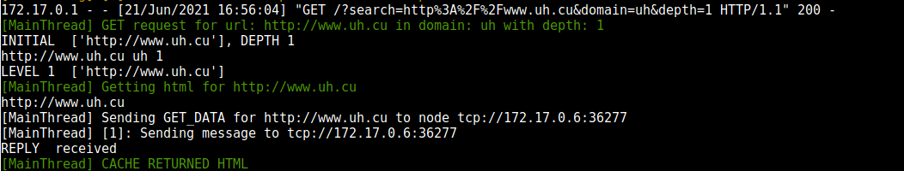

# Distributed Scrapy
#### Claudia Olavarrieta Martínez C411
#### Marcos Adrián Valdivié Rodríguez C412
***
Distributed Scrapy es un sistema distribuido que permite realizar scrap a urls. Está 
compuesto por nodos de almacenamiento, con un funcionamiento similar al de una caché y nodos 
de servidor a los cuales se conectarían los clientes para realizar sus pedidos. Con el objetivo
de una mejor visualización del contenido se brinda un servidor HTTP donde el cliente puede insertar
los pedidos y visualizar o descargar los resultados.

***
## Funcionamiento del sistema

Para acceder al sistema luego de ejecutarse se debe conectar a través del navegador de su preferencia a una 
de las direcciones de servidores HTTP que se muestran en la consola. Esto abre una sencilla página web donde 
deben insertarse la url, el dominio y la profundidad que se desee en el scrap a realizar. La respuesta se envía 
como un adjunto en formato HTML al cliente donde se puede escoger entre verlo en el navegador o 
guardarlo como archivo.

****IMPORTANTE:** se recomienda para profundidades mayores que 1 que se guarde el archivo pues no se asegura el 
correcto comportamiento del navegador.** 

***

## Implementación 
A continuación explicaremos el diseño y funcionamiento de cada fichero incluido en la solución.

#### chord.py
Incluye una clase `Node` la cual contiene los métodos necesarios para mantener un _Distributed Hash Table (DHT)_, 
con el propósito de ser utilizada por los nodos de almacenamiento para guardar la información.                     
La clase se inicializa pasando como parámetros el nodo servidor al que debe conectarse, el cual le asignará el id
y le permitirá consultar por la existencia de otros nodos.              
Para la comunicación de estos nodos se utilizan dos sockets TCP que responden al patrón ROUTER/DEALER de zmq. 
El funcionamiento es el siguiente: el socket zmq.ROUTER espera por los pedidos, ya sea de otros nodos de chord o 
de nodos de servidor, luego transmite estos mensajes al DEALER que se encarga de distribuirlos equitativamente 
entre los workers. Los workers son hilos que poseen un socket ROUTER que recibe los mensajes del distribuidor. 
Es decir, se sigue un patrón Dispatcher-Worker entre el DEALER y los workers ya que cada pedido entrante se procesa
en un hilo diferente e independiente a los demás.                      
Los pedidos que atienden los nodos de chord son los siguientes: 
    
* SUCCESOR: El nodo devuelve su sucesor inmediato.

* PREDECESOR: El nodo devuelve su predecesor inmediato.

* NOTIFY: El nodo que envía el mensaje dice ser el antecesor del nodo actual, actualizar la tabla si la información es 
correcta.

* LOOKUP: El nodo devuelve el primer nodo activo con id mayor o igual que el enviado en el mensaje.

* FIND_PREDECESSOR: El nodo debe devolver el predecesor del id que se le pida.

Además como parte de la clase se tienen dos sockets bajo protocolo UDP con el único propósito de enviar mensajes 
PING y recibir la respuesta, para de esta forma conocer la disponibilidad de otros nodos enviando un mensaje de 
PING y recibiendo el correspondiente PONG, en caso de que este no se reciba, una cierta cantidad de veces, significa que el nodo no esta 
disponible por pérdida de conexión o por alguna falla interna.          

Como parte de la clase se ejecutan dos hilos en el background encargados de mantener la información de las 
Finger Table (FT) consistente. 
El primer hilo pregunta constantemente por el predecesor de su sucesor actual y actualiza su sucesor con el 
nodo devuelto en caso de que no sea el mismo, luego selecciona una posición al azar de la FT y hace un lookup 
para buscar si el valor de esa posición es correcto y actualizarlo si es necesario. 
El segundo hilo se encarga de mantener en el nodo una lista con los sucesores inmediatos del mismo, para de esta 
forma lograr, en caso de que falle el primero, actualizar la FT con el siguiente nodo en la lista y no perder 
la disponibilidad del sistema. Esa lista de sucesores se usa además para la replicación de los datos.


#### chordServer.py
La clase chordServer constituye un mixin con las funciones necesarias para el registro e inicialización de los 
nodos de chord. Incluye los procedimientos registerNode y getRandomNode que son utilizados en el servidor para 
manejar la unión de un nuevo nodo de chord al sistema. El primero es el encargado de asignarle al nuevo nodo su id, 
y el segundo es el encargado de devolver un nodo ya registrado al que el nuevo nodo pueda unirse para iniciar las 
comunicaciones.

#### cache.py

Incluye una clase `CacheNode` la cual hereda de la clase `Node` de chord. Es decir, la función de los nodos de caché 
es comportarse como una Tabla de Hash distribuido donde los hash a almacenar son las URL que piden los clientes y 
los datos guardados serían los correspondientes ficheros HTML resultantes de realizar el scrap. 
Esta clase implementa un método de hash propio, esto se debe a que la función de hash provista por python no es 
consistente si se ejecuta en distintos host, es decir, no tiene por que devolver los mismos resultados para la 
misma url. Utilizando el hash implementado en la clase se garantiza que todos los nodos que se estén ejecutando 
asignen el mismo hash a una url dada.                    
Al heredar de los nodos de chord se heredan los cuatro sockets, dos TCP para responder y enviar pedidos de otros nodos 
y dos UDP para los mensajes de PING/PONG. Este nodo de caché, además de contestar los pedidos que responden los nodos 
chord atienden también pedidos específicos de caché, estos son:

* GET_URL: Se recibe como parámetro la url que se desea conocer si esta almacenada en caché. El nodo es encargado de 
preguntar quién es el poseedor del hash de dicha url haciendo un lookup por dicho hash. Una vez encontrado el nodo, 
que puede ser, en un principio, el mismo al que le hicieron el pedido, debe devolver el html correspondiente en caso de
estar guardado en la caché, o un mensaje de "Empty" en caso contrario.
   
* SAVE_URL: Se recibe como parámetro una url y el html resultante de hacer scrap a dicha url. El nodo debe buscar el 
encargado del hash de la url y reenviar los datos a ese nodo para que guarde la información, o guardarla si el mismo 
nodo es el responsable de esa url.                    

Una parte importante de estos nodos de caché era mantener la disponibilidad de los datos, es decir, ante el fallo de 
algún nodo de caché, no debía perderse toda la información. Es por esto que se mantiene un hilo ejecutándose en el 
background encargado de replicar los datos. Para hacer esta replicación se toma constantemente un nodo de la lista 
de sucesores y se le copian todos los datos que pertenecen exclusivamente al nodo actual. Los mensajes PUSH y PULL
se usan para indicar tráfico de datos entre estos nodos.

* PUSH: El nodo recibe un conjunto de datos que envía el nodo que está enviando el mensaje PUSH. Estos son los datos 
que se desean replicar, en caso de que el nodo actual no los posea, estos se guardan.

* PULL: El nodo que recibe este pedido debe enviar los datos que tenga guardados hasta el momento y que pertenezcan 
al nodo que realizó el pedido para que este se haga cargo de ellos.  


#### FlatServer.py

Contiene una clase llamada `Node`, el objetivo de estos nodos es representar un servidor con todos los nodos 
interconectados. Para el correcto funcionamiento de estos nodos fue necesario un coordinador que se encargara de 
asignar un identificador único a los nodos que se unen, aunque en un principio cualquiera de los nodos del Flat Server 
estaría capacitado para asumir este rol, fue necesario implementar un algoritmo de elección para seleccionar cual nodo
sería el encargado. Esta clase se implementó con el objetivo de ser una clase base para los nodos que atenderían los 
pedidos de los clientes, y a su vez guardara información sobre las direcciones y los ids de los nodos de caché.             
De la misma manera que los nodos de chord, esta clase posee cuatro sockets. Dos sockets TCP para atender pedidos de 
otros nodos de flat server o nodos de caché, y dos sockets UDP para PING/PONG.                  
El primer paso que debe realizar esta clase es unirse a otro nodo del mismo tipo, a menos que aún no exista ninguno 
corriendo. Para unirse a otro nodo, envía un mensaje de JOIN a la dirección de puerto TCP que se le pasa como parámetro 
y espera una respuesta de ACCEPTED.       
Una vez el nodo se une al sistema puede comenzar a recibir y enviar peticiones a otros nodos. Los tipos de pedidos que 
atiende el FlatServer son los siguientes:

* JOIN: El nodo que recibe este mensaje debe enviar al nodo que desea unirse un identificador. Para esto, si el nodo 
que recibe el mensaje es el coordinador actual envía directamente el identificador. Si no, debe reenviar la solicitud 
de unión al coordinador y esperar por su respuesta. En caso de que el coordinador no este disponible, es decir, al no 
recibir una respuesta de PONG cuando se le hace PING con el socket UDP, pues el nodo comienza una elección, el hilo 
que atiende el pedido JOIN se detendrá en un ciclo hasta que se conozca el nuevo coordinador. 
El proceso de elección se explicará en detalle más adelante.

* ACCEPTED: Un nodo recibe este mensaje solo si envió un JOIN previamente, junto con el código ACCEPTED se recibe el 
identificador para el nodo y la información sobre el resto de nodos en la red y el actual líder. 

* ADD_NODE: Este mensaje es enviado por el coordinador cuando un nuevo nodo se conecta a la red, él es el encargado 
de enviar a todos los nodos conectados hasta el momento la información del nuevo nodo que se unió. Cuando un nodo 
recibe este mensaje, recibe además la información del nuevo nodo y debe guardar estos datos.

* ELECTION: Cuando un nodo se da cuenta de que el líder esta caído entonces comienza una elección utilizando el 
algoritmo bully. Para esto el nodo envía mensajes con el encabezado ELECTION a todos los nodos con id mayor igual que 
el suyo y si recibe algún ACK de uno de estos nodos entonces espera por la llegada de un mensaje COORDINATOR, si no,
entonces se declara a el mismo como líder y  se encarga de enviar los mensajes de COORDINATOR a los demás nodos. 
Si un nodo recibe un mensaje de ELECTION desde otro nodo simplemente envía el ACK para decirle al nodo que se hará 
cargo de la elección a partir de ese momento. 

* COORDINATOR: Cuando un nodo recibe un mensaje de COORDINATOR solo actualiza quien es su líder actualmente. 

El sistema de PING/PONG de estos nodos sirve además para reconectar la red si esta en algún momento queda particionada,
haciéndole PING y actualizando el estado de la conexión caída tan pronto como esta vuelva a estar disponible.

#### broker.py

La clase `Broker` que se encuentra en este archivo es la que representa a los nodos del servidor distribuido 
mantienendo la conexión entre ellos y a su vez con la caché. Esta clase hereda de FlatServer y de ChordServer, por 
lo tanto representa la capa superior de nuestros nodos distribuidos. Estos nodos se encargan de manejar los pedidos 
que realiza un nodo de caché cuando se conecta. Con el objetivo de añadir los nodos se implementaron los siguientes 
pedidos:

* JOIN_GROUP: se recibe como parámetros las direcciones TCP y UDP por las cuales estará escuchando el nodo que hace 
el pedido. Se almacena la informacion del nodo y luego se envía un mensaje de ADD_GROUP al resto de los nodos de 
servidor conectados para que añadan el nuevo nodo. 

* ADD_GROUP: Se recibe cuando un nodo intentó conectarse como aviso por parte del nodo que atendió el pedido, 
contiene como parámetros la información del nuevo nodo. 

* RANDOM_NODE: Recibir este mensaje significa que existe un nodo de caché tratando de conectarse, por este motivo, 
el nodo actual devuelve la información de algún otro nodo de caché existente para que se conecte.
 
Dentro de las funciones del broker está manejar los pedidos a la caché, para esto cuenta con dos métodos: 

* get_cache_data: Este se encarga de preguntar a algún nodo de caché disponible por una url en específico y devuelve 
la respuesta, en caso de que exista la url en caché devueve el html, en caso contrario no devuelve nada. 

* save_cache_data: Envía a algún nodo disponible la información de una url a la que se le haya realizado scrap para 
que sea almacenada por el nodo de caché correspondiente. 

#### HttpServer.py

Con el objetivo de lograr una visualización de los resultados y una utilización más sencilla del sistema se creó un 
servidor HTTP, el cual solo tiene como función recibir los parámetros para hacer el scrap.             
Dentro de este script se encuentran tres clases `HTMLParser`, `HTTPHandler` y `HttpServer`.                 

**HttpServer**                       
Hereda de HTTPServer, clase que se encuentra en la módulo __http.server__. Esta clase recibe como parámetros un 
HTTPHandler el cual se encarga de manejar los pedidos GET (únicos utilizados en nuestro servidor) y recibe, también, 
un `Broker`, el cual cumple la función de intermediario entre el HttpServer y la caché. Posee además el método 
encargado de realizar el scrap en profundidad de la url insertada, preguntando siempre si existe el contenido en la 
caché, consultas que se realizan a través del broker.               

**HTTPHandler**                 
Esta clase solo se encarga de manejar el pedido GET, manejando la query y devolviendo el resultado correspondiente, 
el cual se obtiene del método de scrap presente en el servidor explicado anteriormente.

**HTMLParser**
Esta clase contiene un método que se encarga de parsear las etiquetas de tipo `<a>` del html con el objetivo de 
recolectar los links de cada página. Una instancia de esta clase se utiliza en el método de hacer el scrap en el 
HTTP Server. 

### Otros detalles

En el archivo _constants.py_ se incluyen los nombres de los tipos de mensajes.                 
El archivo _logFormatter.py_ es solo con el propósito de dar formato a los mensajes en la consola. 
 
***

## Dependencias

El proyecto utiliza los siguientes módulos:

* urllib (por defecto con el lenguaje)

* http.server (por defecto con el lenguaje)

* zmq (debe ser instalada)


***
## Ejecución
Los únicos ficheros que deben ejecutarse para el funcionamiento del sistema son HttpServer y cache.

Argumentos para ejecutar HttpServer

* ```--portin``` Puerto por donde se escucharán los pedidos TCP. Tipo entero, no obligatorio, por defecto 5000.

* ```--address``` Dirección de otro nodo de servidor al que conectarse. Tipo string, no obligatorio. En caso de no definirse 
el nodo iniciará solo, como un servidor independiente.

* ```--httpport``` Puerto por donde se escucharán los pedidos HTTP. Tipo entero, no requerido, por defecto 5001. 

* ```--nbits``` Número de bits del modelo chord. Tipo entero, no requerido, por defecto 5, aunque debería tomar un 
valor mucho mayor, se deja así para evitar el exceso de información en las salidas en las consolas y por tanto ayudar 
a la comprobación del correcto funcionamiento del programa.

Ejemplo:              
```bash
python3 HttpServer.py --address 172.17.0.3:5000 --portin 8000 --httpport 10200
```

Argumentos para ejecutar cache:       
  
* ```-ns --nameserver``` Dirección del servidor al cual conectar la caché. Tipo string, requerido

Ejemplo:
```bash
python3 cache.py -ns 172.17.0.3:5000
```

***

## Importante

**El puerto 5555 está reservado para los sockets UDP. NO DEBE USARSE PARA OTRAS CONEXIONES.**       

El proyecto está diseñado para ser ejecutado en la red por lo que en un mismo host podrán ejecutarse tantos nodos de 
caché como se deseen pero debido a la restricción con el puerto UDP solo se podrá ejecutar un nodo HttpServer. 
**Dos nodos de servidor no deben coexistir en el mismo host.**

***

## Dockerfile

Se proporciona además un Dockerfile para crear la imagen de docker con las dependencias y el programa listo para ser 
ejecutado.


***

## Ejemplo de ejecución

A continuación describiremos los pasos para probar el programa utilizando docker

* Abrir varios contenedores de docker sobre la imagen proporcionada.
 
* En la consola del primer contenedor, correr el comando **```$ python HttpServer.py```** para inicializar el primer
servidor HTTP. Se mostrarán en la consola las direcciones por las que el servidor escuchará los pedidos HTTP y TCP.


* En la consola del segundo contenedor, correr el comando **```$ python HttpServer.py -a <address>```** donde **address** 
corresponde a la dirección TCP que mostró el contenedor anterior.


* Abra todos los servidores HTTP que desee siguiendo el paso anterior, siempre especificando la dirección TCP de otro 
servidor HTTP que se encuentre corriendo. Recuerde que de no especificar esa dirección el nuevo servidor correrá de 
manera independiente.

* Para abrir los nodos de caché es necesario escribir en la consola del contenedor el comando 
**```$ python cache.py -ns <address>```** donde **address** corresponde a la dirección TCP de algún nodo servidor que 
se encuentre corriendo actualmente.


 
* Puede correr tantos nodos de caché como desee siempre especificando la dirección TCP de un nodo de servidor que se 
encuentre corriendo actualmente.

* **En un mismo contenedor no puede correr más de un proceso de servidor HTTP debido al uso del puerto 5555 para las 
comunicaciones UDP**.

* Para obtener el html de la url deseada abra en el navegador de su preferencia una pestaña y escriba la dirección HTTP
de un nodo de servidor que se encuentre corriendo actualmente, **importante escribir la dirección HTTP y no la TCP**, vea 
la salida en consola del contenedor para obtener estas direcciones. Verá una página sencilla donde deberá introducir 
la url, el dominio y la profundidad de la búsqueda deseada. Es obligatorio proporcionar valores para los campos **URL** 
y **DEPTH**, el campo **DOMAIN** se utiliza para buscar solo los en las urls de las páginas que se encuentren en el
dominio proporcionado. 


 
* Presione el botón **Submit** y el programa se encargará de obtener de internet, o de la caché en caso de que 
esté guardada, el html de la url proporcionada. Para saber desde donde se obtuvo la url vea la salida en consola del 
servidor al cual se conectó a través del navegador.



* Verá un cuadro de diálogo en el navegador con las opciones de abrir y ver la url o salvarla. Es importante que, en caso
de haber enviado a analizar con profundidad mayor que 1, al seleccionar ver la url puede ocurrir que el navegador no sea
capaz de mostrar todos los html que se obtuvieron, por lo que en este caso se recomienda guardarlas en un archivo local.

* Cierre y abra nuevos nodos en los contenedores para que compruebe la disponibilidad del sistema. Cuando abra los nodos de 
caché es posible que estos intenten conectarse inicialmente sin éxito a otros nodos de caché que no se encuentren 
corriendo, es necesario esperar a que el nodo termine este proceso, conectándose a un nodo abierto, para poder correr el 
siguiente nodo de caché, espere por el mensaje en la consola del contenedor que especifica el sucesor del nodo, o por el 
mensaje que explica que no existe ningún otro nodo corriendo, para poder correr el siguiente nodo.


* Cierre el nodo coordinador de los nodos servidores y espere a que los demás nodos adviertan que el nodo no está 
disponible para que observe el desarrollo del proceso de elección.

  


          


